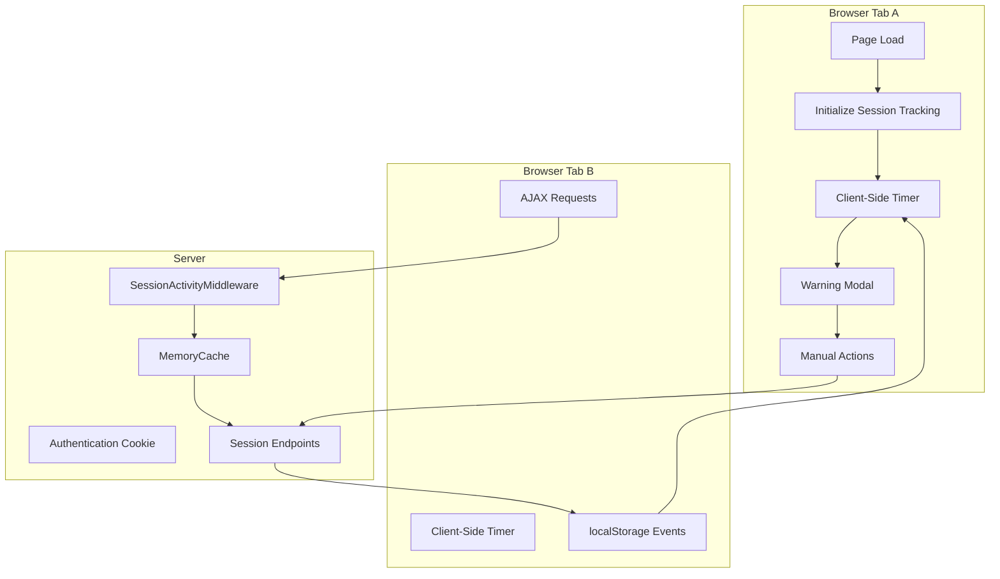

# Auto-Logout System Flow Diagram

## High-Level Architecture



## Detailed Request Flow

### 1. Initial Page Load & Setup

```
1. User loads page
   ↓
2. Razor view calculates initial timeout from site.MaximumInactivityInMinutes
   ↓
3. JavaScript initializeSessionTracking() sets sessionState.expiresAt
   ↓
4. startSessionMonitoring() begins 1-second interval timer
```

### 2. Normal Activity (AJAX Requests)

```
User makes AJAX request (e.g., API call, form submit)
   ↓
Request passes through authentication middleware
   ↓
Authentication cookie sliding expiration extends server session
   ↓
SessionActivityTrackingMiddleware.InvokeAsync() detects authenticated user
   ↓
Calls sessionActivityService.UpdateActivity(userId, siteId)
   ↓
MemoryCache entry updated with new expiry time
```

### 3. Session Status Checking (When Close to Expiry)

```
Client-side timer detects < 2 minutes remaining
   ↓
Throttled check: only call server every 10 seconds
   ↓
AJAX call to /Account/GetActualSessionTime
   ↓
Controller calls sessionActivityService.GetSessionExpiry() (read-only)
   ↓
Returns cached expiry time WITHOUT extending session
   ↓
JavaScript compares server time vs expected client time
   ↓
If significantly different → session was extended by other activity
   ↓
Update sessionState.expiresAt and hide warning modal
```

### 4. Cross-Tab Synchronization

```
Tab A: User activity extends session
   ↓
Tab A: localStorage.setItem('sessionExtended', {...})
   ↓
Tab B: storage event listener triggered
   ↓
Tab B: Updates sessionState.expiresAt from localStorage
   ↓
Tab B: Hides warning modal if shown
```

### 5. Warning and Logout Flow

```
remainingSeconds <= 60
   ↓
Show warning modal with countdown
   ↓
User chooses:
   ├─ "Stay Logged In" → Call /Account/RemainingSessionTime (extends session)
   ├─ "Log Out" → Call logout endpoint
   └─ No action → remainingSeconds reaches 0 → Redirect to logout
```

## Key Implementation Details

### Server-Side Components

1. **SessionActivityService** (MemoryCache-based)
   - `UpdateActivity()`: Records last activity time for user+site
   - `GetSessionExpiry()`: Returns cached expiry (read-only, no extension)
   - `RemoveSession()`: Cleanup on logout

2. **SessionActivityTrackingMiddleware**
   - Runs after Authentication, before Authorization
   - Updates cache for all authenticated requests
   - Excludes `/GetActualSessionTime` endpoint

3. **AccountController Endpoints**
   - `/GetActualSessionTime`: Read-only session check (no extension)
   - `/RemainingSessionTime`: Traditional endpoint that extends session

### Client-Side Logic

1. **Session State Management**
   ```javascript
   sessionState = {
       expiresAt: null,        // Calculated expiry timestamp
       warningShown: false,    // Modal visibility state
       autoLogoutEnabled: false, // Feature toggle
       lastServerCheck: 0      // Throttling server calls
   }
   ```

2. **Smart Server Polling**
   - Only polls when < 2 minutes remaining
   - Throttled to once per 10 seconds maximum
   - Distinguishes between session extensions vs normal countdown

3. **Cross-Tab Communication**
   - localStorage events for session extensions
   - Prevents unnecessary server calls across tabs
   - Synchronized warning modal state

## Problem Solved: The "Observer Effect"

### Before (Problematic)
```
Check session time → AuthenticateAsync() → Extends session → Wrong client timer
```

### After (Fixed)
```
Normal request → Middleware updates cache → Client polls cache (no extension)
```

## Multi-Tenant Considerations

- Uses `ISiteContextResolver` for tenant-aware configuration
- Session cache keys include both userId and siteId
- Supports folder-based tenancy in URL routing
- Per-site auto-logout configuration via `MaximumInactivityInMinutes`

## Error Handling

1. **Disabled Auto-Logout**: No monitoring when `MaximumInactivityInMinutes` is null/zero
2. **Network Errors**: Conservative approach - log error but don't auto-logout
3. **Multi-Tab Conflicts**: Last active tab wins, others sync via localStorage
4. **Login Page Edge Case**: Check authentication status before enabling tracking

## Performance Optimizations

- MemoryCache auto-expiry prevents memory leaks
- Throttled server polling (10-second minimum)
- Lazy initialization only for authenticated users
- Minimal localStorage updates (only on actual extensions)

---

This implementation successfully resolves the core issue where AJAX activity wasn't preventing auto-logout, while maintaining clean separation between session checking and session extension.